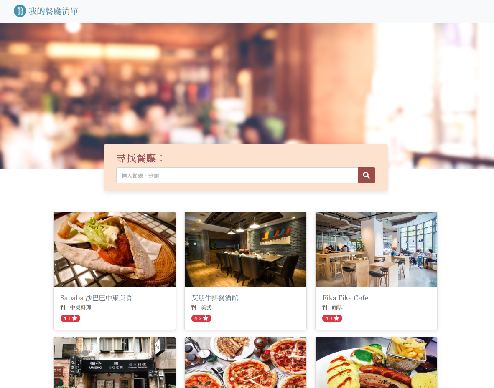

# 我的餐廳清單



## 介紹

紀錄只屬於自己的餐廳清單，可以瀏覽餐廳、查看詳細資訊、連結到地圖，也可以使用餐廳名稱搜尋餐廳。

### 功能

* 查看所有餐廳
* 瀏覽餐廳的詳細資訊
* 連結餐廳的地址到 Google 地圖
* 使用文字搜尋餐廳名稱

## 安裝流程

1. 開啟終端機(Terminal)
2. 確認是否有安裝 Node.js 與 Npm
3. cd 到欲存放專案的本機位置並執行 clone

```
git clone https://github.com/ConnieSheep/restaurant_list.git
```

4. 進入存放專案的資料夾

```
cd restaurant_list
```

5. 安裝 npm 套件，輸入

```
npm install
```

6. 安裝完畢，輸入

```
npm run start
```

7. 若看見此行訊息代表順利執行，打開瀏覽器並輸入下列網址

```
Listening on http://localhost:3000
```

8. 若欲暫停則按下

```
ctrl + c
```

## 開發工具

* Node.js 14.16.0
* Express 4.16.4
* Express-Handlebars 3.0.0
* Font-awesome 6.1.1
* Bootstrap 5.2.0